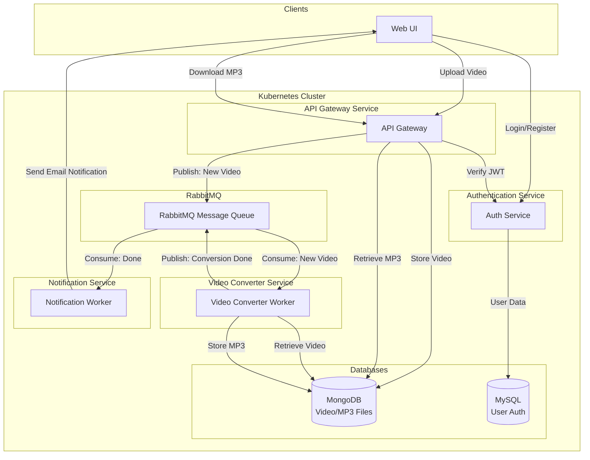

# Video to MP3 Converter - Microservice Architecture Plan

## Architecture Overview

The system follows an event-driven microservice pattern:



## Project Structure

```
converter_video_mp3/
├── services/
│   ├── api-gateway/           # FastAPI gateway service
│   │   ├── app/
│   │   │   ├── main.py
│   │   │   ├── routers/
│   │   │   │   ├── upload.py
│   │   │   │   ├── download.py
│   │   │   │   └── auth.py
│   │   │   ├── models/
│   │   │   ├── services/
│   │   │   └── config.py
│   │   ├── Dockerfile
│   │   ├── requirements.txt
│   │   └── k8s/
│   │       ├── deployment.yaml
│   │       └── service.yaml
│   │
│   ├── video-converter/       # FFmpeg-based converter worker
│   │   ├── app/
│   │   │   ├── main.py
│   │   │   ├── worker.py
│   │   │   ├── converter.py
│   │   │   └── config.py
│   │   ├── Dockerfile
│   │   ├── requirements.txt
│   │   └── k8s/
│   │       ├── deployment.yaml
│   │       └── service.yaml
│   │
│   ├── notification-service/  # Email notification worker
│   │   ├── app/
│   │   │   ├── main.py
│   │   │   ├── worker.py
│   │   │   ├── email_sender.py
│   │   │   └── config.py
│   │   ├── Dockerfile
│   │   ├── requirements.txt
│   │   └── k8s/
│   │       ├── deployment.yaml
│   │       └── service.yaml
│   │
│   └── auth-service/          # User authentication service
│       ├── app/
│       │   ├── main.py
│       │   ├── routers/
│       │   │   ├── auth.py
│       │   │   └── users.py
│       │   ├── models/
│       │   │   └── user.py
│       │   ├── services/
│       │   │   └── auth.py
│       │   ├── db.py
│       │   └── config.py
│       ├── Dockerfile
│       ├── requirements.txt
│       └── k8s/
│           ├── deployment.yaml
│           └── service.yaml
│
├── web-ui/                    # React frontend
│   ├── src/
│   │   ├── components/
│   │   ├── pages/
│   │   │   ├── UploadPage.jsx
│   │   │   ├── DownloadPage.jsx
│   │   │   └── LoginPage.jsx
│   │   └── services/
│   │       └── api.js
│   ├── package.json
│   └── Dockerfile
│
├── k8s/                       # Kubernetes manifests
│   ├── mongodb/
│   │   ├── deployment.yaml
│   │   ├── service.yaml
│   │   └── pvc.yaml
│   ├── mysql/
│   │   ├── deployment.yaml
│   │   ├── service.yaml
│   │   └── pvc.yaml
│   ├── rabbitmq/
│   │   ├── deployment.yaml
│   │   └── service.yaml
│   ├── configmaps/
│   │   └── app-config.yaml
│   └── secrets/
│       └── app-secrets.yaml
│
├── scripts/
│   ├── setup-local.sh          # Local setup script
│   └── deploy-k8s.sh          # Kubernetes deployment script
│
├── pyproject.toml              # Root Python config
├── docker-compose.yml          # Local development
├── README.md                   # Updated documentation
└── DEPLOYMENT.md              # Deployment guide
```

## Technology Stack

### Core Technologies
- **Python 3.12+** - All microservices
- **FastAPI** - API Gateway and Auth Service
- **Celery + RabbitMQ** - Task queue and message broker
- **FFmpeg** - Video to MP3 conversion
- **React 18** - Web UI client
- **Kubernetes** - Orchestration and deployment
- **MongoDB** - GridFS for file storage (videos/MP3s)
- **MySQL** - User authentication and JWT management
- **JWT** - Authentication tokens

### Key Python Libraries
- `fastapi` - Web framework
- `uvicorn` - ASGI server
- `pika` - RabbitMQ client
- `pymongo` - MongoDB driver
- `motor` - Async MongoDB driver
- `sqlalchemy` - MySQL ORM
- `bcrypt` - Password hashing
- `python-jose` - JWT handling
- `python-multipart` - File uploads
- `aiosmtplib` - Async email sending

## Implementation Tasks

### Phase 1: Infrastructure Setup
1. Create project directory structure
2. Set up Docker Compose for local development
3. Create Kubernetes manifests for:
   - MongoDB with PersistentVolumeClaim
   - MySQL with PersistentVolumeClaim
   - RabbitMQ
   - ConfigMaps and Secrets
4. Create root pyproject.toml for workspace management

### Phase 2: Authentication Service
1. Implement user registration/login endpoints in `[services/auth-service/app/routers/auth.py](services/auth-service/app/routers/auth.py)`
2. Create User model in `[services/auth-service/app/models/user.py](services/auth-service/app/models/user.py)` with SQLAlchemy
3. Implement JWT token generation and validation
4. Set up MySQL database connection in `[services/auth-service/app/db.py](services/auth-service/app/db.py)`
5. Create Dockerfile and Kubernetes manifests

### Phase 3: API Gateway
1. Create FastAPI application in `[services/api-gateway/app/main.py](services/api-gateway/app/main.py)`
2. Implement upload endpoint in `[services/api-gateway/app/routers/upload.py](services/api-gateway/app/routers/upload.py)`:
   - Authenticate JWT
   - Store video in MongoDB GridFS
   - Publish message to RabbitMQ queue
3. Implement download endpoint in `[services/api-gateway/app/routers/download.py](services/api-gateway/app/routers/download.py)`:
   - Verify JWT and job completion
   - Retrieve MP3 from MongoDB GridFS
4. Create Dockerfile and Kubernetes manifests

### Phase 4: Video Converter Service
1. Create Celery worker in `[services/video-converter/app/worker.py](services/video-converter/app/worker.py)`
2. Implement FFmpeg conversion logic in `[services/video-converter/app/converter.py](services/video-converter/app/converter.py)`
3. Worker flow:
   - Consume message from RabbitMQ
   - Retrieve video from MongoDB
   - Convert to MP3 using FFmpeg
   - Store MP3 in MongoDB GridFS
   - Publish completion message to RabbitMQ
4. Create Dockerfile with FFmpeg installation and Kubernetes manifests

### Phase 5: Notification Service
1. Create Celery worker in `[services/notification-service/app/worker.py](services/notification-service/app/worker.py)`
2. Implement email sender in `[services/notification-service/app/email_sender.py](services/notification-service/app/email_sender.py)`
3. Worker flow:
   - Consume completion message from RabbitMQ
   - Send email with download link and unique ID
4. Create Dockerfile and Kubernetes manifests

### Phase 6: Web UI
1. Initialize React app with Vite
2. Create authentication pages in `[web-ui/src/pages/LoginPage.jsx](web-ui/src/pages/LoginPage.jsx)`
3. Create upload page with progress tracking in `[web-ui/src/pages/UploadPage.jsx](web-ui/src/pages/UploadPage.jsx)`
4. Create download page in `[web-ui/src/pages/DownloadPage.jsx](web-ui/src/pages/DownloadPage.jsx)`
5. Implement API client in `[web-ui/src/services/api.js](web-ui/src/services/api.js)`
6. Create Dockerfile and Kubernetes manifests

### Phase 7: Integration & Testing
1. Update README with architecture and usage instructions
2. Create DEPLOYMENT.md with K8s setup guide
3. Create setup scripts for local and K8s deployment
4. Test end-to-end flow:
   - User registers/logs in
   - Uploads video
   - Waits for conversion
   - Receives email notification
   - Downloads MP3

## Key Design Decisions

### MongoDB GridFS for Files
- Use GridFS for storing large video files and MP3s
- Store metadata in separate collection
- Unique file IDs for all operations

### RabbitMQ Queue Design
- Queue 1: `video.conversion.tasks` - Video conversion jobs
- Queue 2: `notification.tasks` - Email notifications
- Use direct exchanges for routing

### JWT Flow
1. User authenticates with Auth Service
2. Receives JWT token
3. Includes JWT in all API requests
4. Gateway validates JWT via Auth Service

### Error Handling
- Dead letter queues for failed messages
- Retry logic for conversion failures
- Email notifications for errors
- Proper HTTP status codes for all endpoints

## Configuration Management

### Environment Variables
- MongoDB connection string
- MySQL connection string
- RabbitMQ connection details
- JWT secret key
- Email SMTP settings
- FFmpeg paths

### Kubernetes ConfigMaps
Application configuration (non-sensitive):
- Queue names
- Database names
- Port numbers
- Retry settings

### Kubernetes Secrets
Sensitive data:
- Database passwords
- JWT secret
- SMTP credentials
- API keys

## Deployment Strategy

### Local Development
Use `docker-compose.yml` for running all services locally with:
- Hot reload for development
- Shared volume for file storage
- Local RabbitMQ, MongoDB, MySQL instances

### Kubernetes Production
- Separate namespaces for staging/production
- Horizontal Pod Autoscaling for workers
- PersistentVolumeClaims for data persistence
- Health checks and liveness probes
- Ingress controller for external access